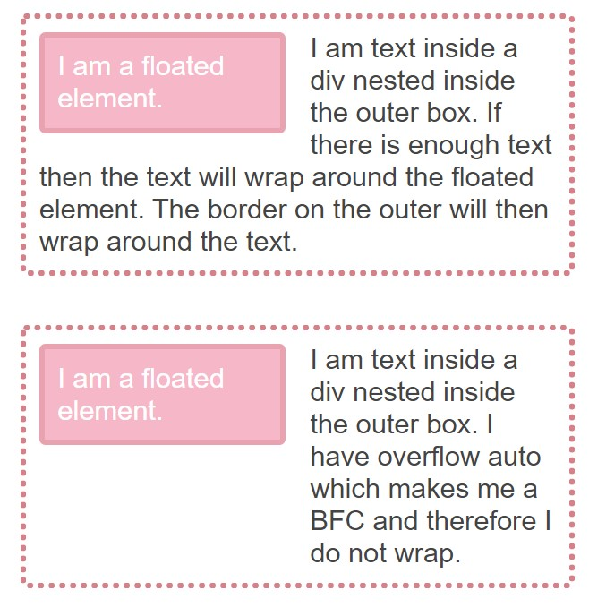
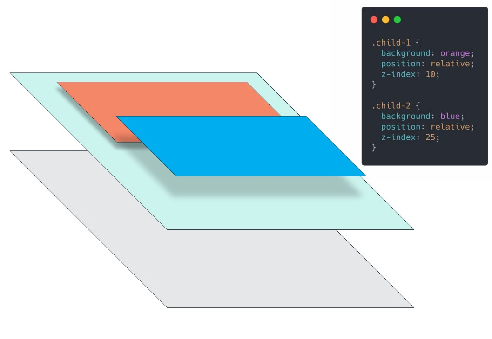

# 02.Understanding CSS

## 0005. css-anatomy-terminology

- an example
  ```css
  p {
    color: #44444;
    font-size: 21px;
  }
  ```
- Here, `p` is a selector
- `color` and `font-size` are properties
- `#44444` and `21px` are value
- the line property and value is called `declaration`
- the whole example is called rule

## 0006. why-is-css-so-weird-an-introduction

- css is not broken
- css works the way it suppose to work
- learn Why Is CSS So Weird? by Miriam Suzanne https://www.youtube.com/watch?v=aHUtMbJw8iA
  - CSS is designed not to loose content and not cause harm
  - there are lots of devices which means the canvas is not exactly known
  - css is there just to suggest how the content should visible
  - the default behavior is not to loose any content, thats why we see overflow content

## 0007. why-is-css-so-weird-a-follow-up

- website and web apps needs to device agnostic, means needs to work regardless of any device
- in early period of css there was pixel perfect design
- then we needed to maintain two css, one for main site and the other is mobile version
- then the responsive design came
- then the web needs to work everywhere
- it not the publisher who control how to display content, Its the audience
  - phone
  - tv
  - screen reader
- browser, device and the user can affect the output
- we have lots of variable- screen size, browsers and type of input
- We're designing for changing and adaptability
- css is written for a world where the creator doesn't have all the information
- we need to describe the intent of the outcome
- we need to make pages that can work without css
- ### css isn't broken when things don't act like you expect them to
- It usually means we simply need to try a different approach, because it has a very good reason for doing what it does(at least most of the time)

## 0008.css-is-all-about-relationships

- every component is connected and have effect in view
- The relationships between:
  - an element and the view port
  - an element and its parent
  - Sibling elements
- We need to take into consideration its relationship
  - Maybe its parent is defining a width instead?
    - If the parent has a width and we declare a width to the child, it might overflow out the side, or it might be a percentage of the parents's width
  - these relationships are controlled by a given elements formatting context
- css is all about relationship between elements we cannot think a component as isolated

# 03.Overlooked Fundamental 1- The box model

## 0009. introduction-to-the-overlooked-fundamentals

- css has global scope
- if components need to isolated then it is not reusable in the sense of css
- css has relationship with html, we can change style just adding class to html
- global scope of css is not a bug its feature so that we can reuse code
- we need to stop worried about global scope, if we understand it we can use it as our advancement

## 0010. the-box-model-and-box-sizing

- an example

  ```css
  .element {
    width: 200px;
    padding: 20px;
    border: 5px solid #820b35;
    margin: 20px;
  }
  ```

  - here the actual width is (20+5+20)\*2+200=290px
  - because the width is for content, so padding order and margin is adding up

- to solve this problem we can use `box-sizing:border-box`
  ```css
  .element {
    box-sizing: border-box;
    width: 200px;
    padding: 20px;
    border: 5px solid #820b35;
    margin: 20px;
  }
  ```
  - using this code the width will be content+padding+border, it will not include margin
  - ### with border-box, margin is not included, because the margin is between two element, if two element has 10px margin than there will be 10px gap not 10+10 = 20 px
- so we can use this css rule to be safe in our design

  ```css
  *,
  *::before,
  *::after {
    box-sizing: border-box;
  }
  ```

  - ### margin can impact another element is a big deal.
  - Intrinsic and extrinsic sizing (learn more in "bonus materials" section)

## 0011. what-happens-when-we-don't-set-a-width

- when we don't set a width to block element then the element take whole width of view or the container, even after adding padding and border it does not overflow but take space from the content
- this is without `box-sizing:border-box`

## 0012. what-happens-when-we-set-a-width

- ```css
  .content {
    border: 50px solid red;
    padding: 50px;
    margin-top: 10em;
    background: white;
    box-shadow: 0 0 3em rgba(0, 0, 0, 0.15);
  }
  ```

- without width default is `width:auto`
- when width is set to `100%` then the content width will be 100% of parent element, that case whole element will be more then 100% so that element will overflow

## 0013. adding-box-sizing

```css
 .content {
   box-sizing:border-box;
   width:100%
   border: 50px solid red;
   padding: 50px;
   margin-top: 10em;
   background: white;
   box-shadow: 0 0 3em rgba(0, 0, 0, 0.15);
 }
```

- here with border box the 100% width will be including padding and border, so there will be no overflow unless there is any word that is with long character
- with border-box if there is no margin then the element will not overflow

## 0014. fixing-a-layout

- when we use main content with a side bar, and we give 70% to main and 30% to side bar, with added padding the whole body can overflow
- we can solve this problem by adding `box-sizing:border-box`

## 0016.Inheritance

- not everything is inherited, but there is a general rule of thumb
- Anything related to typography is inherited

  ```txt
    font-size
    font-family
    text-decoration
    color

  ```

- using this inheritance feature we set the common style for html, so that all child have same property

  ```css
  html {
    font-family: "really-nice-font";
    font-size: 1.125rem;
    font-weight: 400;
    line-height: 1.7;
  }
  ```

- nothing related to layout is inherited

  ```txt
    margin
    padding
    height
    width
    position

  ```

- The following do not inherit things like you’d expect them to

  -

  ```html
  <button>
  <input>
  <optgroup>
  <select>
  <textarea>


  ```

- We can make them inherit those properties if we'd like

  ```css
  button,
  input,
  optgroup,
  select,
  textarea {
    font-family: inherit;
  }
  ```

- Use this to your advantage(depending on the design of course)

  ```css
  a {
    color: inherit;
  }
  h2,
  h3,
  h4 {
    font-weight: inherit;
  }
  ```

## 0017.A quick look at inheritance in action

- we should take advantage of inheritance, all typographical property which is related to font will inherit from parent, unless there is a browser default, for this a tag color is blue by browser thats why we need to explicitly write the color for a tag.
- if we put center on a tag it does nothing since it is a inline element and it takes the space of content

## 0018.A little project

- finished the project in 0018.A little project>01.1 answer
- there is also style guide which i did not follow

## 0019.A little project my solution

- line-height is unit less and related to font-size, so `line-height:1` is 1 em which is `1* font-size`
- for smaller font size line-height is bigger, and when the font-size bigger line-height is smaller

## 0020.A little project follow up

- 1 rem is 1 \* font-size of html root element or html tag,
- so if we set the font-size in html then all the rem value will increase
- ### so keep mind html font-size is important for rem unit

# 05.Overlooked Fundamentals 3. The Cascade

## 0021.Introduction to the cascade

- focus on cascade, how we should use it
- we should not separate or isolate of element style rather we should use the cascading feature in our advantage

## 0022.How well do you really know it

- example, what color will have in these 2 div

  ```css
  .red {
    background: red;
  }
  .blue {
    background: blue;
  }
  ```

  ```html
  <div class="red blue">
    <div class="blue red"></div>
  </div>
  ```

- it will be blue
- ### how it calculate which rule should be apply
  - 1. Origin and Importance
  - 2. Specificity
  - 3. Order of Appearance

## 0023.Importance and origin

- Origin and importance order

  - 1.user declarations with !important
  - 2. Author declaration with !important
  - 3. Author ( css in the page ) declaration
  - 4. User declaration
  - 5. User agent ( browser default) declaration

- so end of the day the user in control of how page should look
- never set font-size to html, then it can override user declaration

## 0024.Origin and font size implications

- just an example showing the bad effect setting font-size in html

## 0025.When animations and transitions get involved

- as css specification
  - 1. Transitions
  - 2. user declarations with !important
  - 3. Author declaration with !important
  - 4. Animation
  - 5. Author ( css in the page ) declaration
  - 6. User declaration
  - 7. User agent ( browser default) declaration
- in reality (chrome and later firefox)
  - 1. user declarations with !important
  - 2. Author declaration with !important
  - 3. Animation
  - 4. Transitions
  - 5. Author ( css in the page ) declaration
  - 6. User declaration
  - 7. User agent ( browser default) declaration

## 0026.Closing thoughts on importance

- there are few situation where we should use !important, like media query so that we can disable animation for small device
- in general we should avoid !important when it is not a specific case

## 0027.Specificity

- the rule is more specific ( h2 vs div.h2) wins
- in early learning steps, there is a suggestion that we should avoid specificity, which is called flat specificity
- to do that we use certain css naming convention
- so we don't need to think about specificity
- if no specificity issue then we can ignore Origin and Importance
- so there will be only `order of importance`
- but as teacher suggested that it is like keeping the learning wheel on as in learning riding cycle.
- if we learn correct then we can use this specificity in our advantages

## 0028.Fixing specificity issues

- example of how specificity make issue and how flat css solve the problem

- https://codepen.io/tkhuong/pen/jOMZwgp

## 0029.Calculating specificity

- https://specificity.keegan.st/ to calculate css specificity
- specificity calculation rules:
  - A. IDs `#container #main #sidebar`
  - B. Classes `.logo`, attributes `[type="text"]` and pseudo-classes `:visited :hover :active`
  - C. Elements `div` and pseudo-elements `::before ::after ::first-line`
  - `#container #main` will calculate 2A,
  - `navbar::before` will calculate 1B+1C
  - A>B>C, so 1A will win with 10B+10C
- ### Special Rules
  - When calculating CSS specificity values, ignore the universal (\*) selector.`* { color: black; }`
  - Only the selector inside the :not() pseudo-class (negation pseudo-class) is counted. The :not() pseudo-class itself does not get counted.`:not(#some-id) { color: purple; } ` Specificity 1A
  - In case of a tie, the selector that’s farthest down the stylesheet wins.

## 0030.Pricing cards introduction

- exercise is done in the folder

## 0031.A safe approach to css

- rewrite the css according to lesson
- BEM convention -`base element modifier`
  - example `plan__title--dark`
- keep the common property in base rule, then use the modifier class to update the changes
- also used a utility class text-accent which is a dry code and we can reuse the class

## 0032.Challenge pricing cards

- answer in the folder

## 0033.My solution pricing cards

- button rules have problem with a tag
- default a tag has default `display:inline`
- `display:inline` can not set height,margin, and padding can be set but does not change content height
- to solve this problem we can use `display:inline-block`

## 0034.Updated design

- tried to solve the design

## 0035.Updated design my solution

- used variable

  - variable are set in root element so that it cant be accessed globally `:root{}`
  - variable name start with `--` double dash `--my-variable`
  - to name the color added clr prefix `--clr-primary-100` here 100 is the color tone
    - 500 is base, 100 is lightest and 900 is darkest
  - to reuse the background color we takeout `--plan-light` to utilities ie- `--bg-light`
  - to use the variable `var(--variable-name)`
  - optionally we can add default value is variable is not defined `var(--variable-name,red)`
  - body,h1..h6,block elements have default margin, we need to reset or change the margin accordingly
  - we can use base with utility class to give separate style(ie separate bg,color)

    ```css
    button {
      margin: 0;
      padding: 2rem;
      border: 0;
      outline: 0;
      background: var(--bg-btn, black);
      color: var(--bg-clr, white);
    }
    dark-element {
      --bg-btn: white;
      --clr-btn: black;
    }
    ```

## 0036.Adding in custom properties

- already did in last commit

## 0037.Setting up the typography

-

## 0038.Mirroring the layout

- used modifier class to mirror the layout
- since the members is a flex layout we can change the order
- we changed the order to 2,
- we fixed the member padding and img left and right margin
- other fixed

  - the css is used two naming, one is bem and other is nesting
  - in bem

    ```html
    <div class="plan">
      <div class="plan__price plan--modifier"></div>
    </div>
    ```

  - without bem to use it as global component style
    ```html
    <div class="plan">
      <div class="price color-pop"></div>
    </div>
    ```

## 0039.Starting to think about class naming

- here talked about BEM naming convention and class separated by specificity
  - bem is for flat css that can be repetitive writing
  - we can use class separator
    - `<class="price"> <class="amount" /></>` we can style it by `.price .amount{}` using specificity along with strict the scope

## 0040.Overlooked fundamentals final project

- practice project
- ## border-radius with padding is evil, radius will overflowed by padding, so be careful when use it with padding
- selectors

  - descendant selector (space)
    - example `div p` select all p that is inside div including Descendant (or not direct child)
  - child selector (>)
    - example `div > p` select all p that direct child of div not Descendant (or not direct child)
  - adjacent sibling selector (+)

    - example `div+p` select immediate sibling that is only p
    - example

      ```html
      <div>
        <p>Paragraph 1 in the div.</p>
        <p>Paragraph 2 in the div.</p>
      </div>

      <p>Paragraph 3. will be selected here</p>
      <p>Paragraph 4. After a div.</p>
      ```

  - general sibling selector (~)

    - example `div~p` select all siblings those are p and after div, this is only direct sibling
    - example

      ```html
      <div>
        <p>Paragraph 2.</p>
      </div>

      <p>Paragraph 3 will select</p>
      <section><p>Some code is not select by the selector</p></section>
      <p>Paragraph 4 will select</p>
      ```

## 0041.My solution

- `display:flex` has `justify-content` to setup space between items in row
- when there is only image in the a tag it is best to use `aria-label=""` attribute to mention the text of the image so that screen reader can read it, `aria-label="twitter"`
- `display:inline-block` uses whole width in grid layout to fix it we can use `align-self:center/end`, `align is top to bottom alignment` `justify` is column wise alignment
- css reset: `img{display:block}`
- use css hover and focus to {opacity:.8} so that it can show that is a actionable thing

# 0042.A word on class naming

- talked about css class naming convention
  - bem
  - compound naming
  - cubic
- naming convention is not a big issue, each naming convention solves a particular problem
- try to be open, and see if any convention is speaking to you, means they are making sense to you

## 0043.Overlooked fundamentals wrap up

- here he talks about practicing and learning and not binge watching it and not absorb the content

## 0044.The unknown fundamentals introduction

- introduction about week 2 modules
- unknown fundamentals where we may struggle

## 0045.Unknown fundamentals project 1 introduction

- here is a hero project to build which i could'nt build

## 0046.Teaching you how to fish

- talks about how to learn new things
- talks about, mdn- mozilla development network
- https://developer.mozilla.org/en-US/docs/Web/CSS
- also good for javascript

## 0047.Introduction to formatting contexts

- formatting context
  - Everything is box, boxes inside box
  - the behavior of boxes depend on the formatting context
  - Four formatting context
    - `block`, `inline`, `flex`, `grid`
  - there are specific rules how content flow or format
  - if we learn these rules we can be consistent and will predict the design

## 0048.Inline formatting context and anonymous boxes

- inline formatting context & anonymous boxes
- common used inline elements are -`SPAN, STRONG, EM, LINKS(<a></a>)`
- inline elements go next to one another
- inline elements have some limitation
- other inline elements `<a><abbr><acronym><b><bdo><big><br><button><cite><code><dfn><em><i><input><kbd><label><map><object><output><q><samp><script><select><small><span><strong><sub><sup><textarea><time><tt><var>`
- In a horizontal writing mode, margins and padding, above and below the element will not be applied.
- When we have a block level element, it can either contain other block elements, or inline elements. it cannot contain a mix of them.
- example

  ```html
  <div>
    sentence 1
    <p>sentence 2</p>

    sentence 3
  </div>
  ```

  - all sentence 1,2,3 are block level element, and sentence 1 and 3 are anonymous element, this is done by the browser under the hood, we don't have any control over it

## 0049.Block formatting context

- Default html context

  - Boxes are laid out one on top of each other. Even if there is room, they won't try to squeeze in.  
     
  - Margin between elements collapse  
        
  - And even move the parent element  
    

- A BFC as like a mini layout inside your page. Once an element creates a BFC

  - Everything is contained inside it.
  - Excludes all externally floated elements
  - Stop margin collapsing
  - Example

    - Without bfc the margin-top of first paragraph and margin-bottom of last paragraph is collapsed,but with bfc it includes the margin.  
      
    - It also makes the floating text block element  
      

- The root of our document (the html element) creates a block formatting context, which all of our content lives inside
- We can create new block formatting contexts within our document as well.
- You can create a new block formatting context in a lot of ways (this is just a few)
  - Using `float`
  - `position` is `abosolute` , `fixed` , or `inline-block`
  - `overflow` of anything except visible
  - Using `columns`
  - Flex and grid items
  - `display: flow-root`
- Note: with so many things creating a new formatting context, and because a new block formatting context stops margins from collapsing, it can be hard to be consistent

## 0050.Formatting context and floats

- example of previous lesson

## 0051.Collapsing margins in action

- in 45.0045.Unknown fundamentals project 1 introduction folder, we updated the hero code by fixing the margin collapse
- if the parent and the child are in same position then the margin collapse happen and parent move with child
- adding padding to parent will break this situation

## 0052.Creating a new formatting context

- solving the problem using block formatting context
- we give the parent `columns:1` and removed the padding and added it to child margin
- with this solution the layout is dependent with child, that type of solution is discouraged by the teacher

## 0053.Flex and grid formatting contexts

- When we declare `display: flex` on an element, it establishes a flex formatting context
- While very similar to establishing a new block formatting context, there are a few differences:
  - `float` and `clear` don't work
  - It's margins do not collapse with it's children's margins
  - The children are part of a flex layout, not a
    box layout
  - The children (flex items), establish their own
    formatting context, means children of flex items does not have the flex formatting contexts
- ### grid formatting context is same as flex formatting context, but different layout
- [example code-pen](https://codepen.io/kevinpowell/pen/11c167c4d7265c9414c3a45904cb2c16)

## 0054.Consistency

- The reason collapsing margins have inconsistency that text element and some other elements have default `margin-top` and `margin-bottom`
- one of the solution is reset

  - some people use below code to reset the default spacing

    ```css
    * {
      box-sizing: border-box;
      margin: 0;
      padding: 0;
    }
    ```

  - there is a problem with this approach, it will also reset some of the defaults that can be useful, like the ul and li when we are using it to show the bullet with padding.
  - To solve the problem we can do a selective reset
  - example

  ```css
  h1,
  h2,
  h3,
  h4,
  p {
    margin: 0;
  }
  ul[class] {
    margin: 0;
    padding: 0;
    list-style: none;
  }
  ```

  - some time we want everything should behave like regular flow, there are two way to achieve that

  ```css
  /*method:1*/
  .flow-content > * {
    margin-bottom: 1rem;
  }
  .flow-content > *:last-child {
    margin-bottom: 0;
  }
  /*method:2*/
  .flow-content > * + * {
    margin-top: 1rem;
  }
  ```

- [code-pen example](https://codepen.io/kevinpowell/pen/83fa8fbdf17588511de97f74a4c326fe)

## 0055.Creating a css rule for flow content consistency

- ### Some fonts can give extra top and bottom gap without any margin or padding
- [code-pen example](https://codepen.io/kevinpowell/pen/83fa8fbdf17588511de97f74a4c326fe)
- demonstrate more on flow-content reset
- we want the grid and the flex flow content to not give the extra space to make it like normal flow text
- `.flow-content > *` all direct child of flow-control
- `.flow-content > *:last-child` save as above but if only is the last child
- `.flow-content > * + *` all direct child of flow-control and has a sibling before it
- we only want to use it where we need it

## 0056.Adding consistency to our magic page

Copy the magic in the air
Added reset

```css
h1,
h2,
h3,
p {
  margin: 0;
}
a {
  display: inline-block;
}
```

Added utility class

```css
.flow-content > * + * {
  margin-top: 1rem;
}
```

All this reset will solve the inconsistency, ie: the padding of hero_content become consistent

## 0057.Magic page finishing touches

Added style to button
Updated margin-top of flow-content
fixed missing style of h2 heading with span

## 0058.A look at the updated design

Completed the exercise, cheated little bit. Join section is left unfinished, overall good

## 0059.Easy wins

Mobile first design- design for mobile first
Then plan what style can be used multiple times and use them in utility class mean common designs
container padding given from variable

## 0060.Adding columns

Added responsive split utility class, which on small column and row on bigger screen

## 0061.The square corner decorations

Added before element, remember to use it without space like `.join-now li::before`, otherwise it will select all the children.
fixed margin reset of ul
added background to cta class

## 0062.Stepping up our spacing utility

Using the spacing variable we can set a default flow-content spacing and increase it with a modifier

# 10.Unknown Fundamentals - Stacking Context & Containing Blocks

## 0063.Stacking context and containing blocks introduction

Stacking context and containing blocks are related

## 0064.Introduction to stacking context

Normally elements placed one after another, but in stack, elements are on top of another.
then we can use the z-index to tell which element to on top, z-index value can be set `-n to +n` the higher the number it will be on top.

## 0065.Exploring z index

The default position value is `static`, if the position value other than static only then we can use z-index.In flex and grid context we can use z-index without using the position

## 0066.Stacking context deep dive

Stacking context create a z-axis for its direct child, children can have their own formatting context. When stacking context created its child are isolated within its plane. Other elements cannot affect it. When we create a new stacking context, z-index is no longer relative to the root, but to that individual context.

  
Here, there are two stacking context, one is with white background and have two children,grey and light blue.Light blue also have two children and it is also a stacking context with two children orange and blue. child 2(blue background), of light-blue has a higher z-index, so it will be top on the stack.

  
If we give light gray element a z-index of 11, it will be on top of the stack, not in between orange and blue element.

  
because the stack context of light gray is different then the its parents. Parent(white background) have two child and its only concern with it, then the stacking context of light blue is different.Thats why the gray element comes on top of the stack.


Similarly to formatting contexts, one of the frustrating things about stacking context is that there are so many things which create a new stacking context!

- The root element of our page
- Both flex and grid items which have a **z-index other than auto**
- Elements with an **opacity that isn't 1**
- Elements with a `transform` , `filter`, `perspective`, `clip-path`, `mask` , or `mix-blend-mode `
- Elements with a `position: absolute` or `position: relative` which **also have a z-index**
- Elements with a `position: fixed` or a `position: sticky`

**This can be incredibly frustrating but knowing what is causing issues with stacking context means you have the tools and knowledge to fix problems when they happen**

## 0067.Stacking context in action

Here teacher show us an example, like the work done in magic 2 design. there we used a before sudo element to create a style and push it back to image.Like that here the box moved under the parent background.but when we create a new stack in content then the box cannot be moved behind the content background.because it is on that background. Earlier it was possible because it was on root stack. the moment we create the content stack, its child cannot scape its box, it remain within.

[stacking context 1 - code-pen](https://codepen.io/kevinpowell/pen/eaf65f67468a027bba85829010ea580d)

## 0068.When stacking context breaks things

Same example is given here but on complex situation, even when we try to add animation, like `transform` it creates a new stack and suddenly css will not work as expected because of new stack context.
[stacking context 2 - code-pen](https://codepen.io/kevinpowell/pen/a8b499ddfc3e4b17a414dc151fabb1e0)

## 0069.Stacking context coming into play

used `.a-center { align-items: center;}` class to align items in center vertically.`.hero img { transform: translateY(2em);}` to move the image 2em down.Now the problem is image is getting on top of the header, cause their z-index are same and img comes after header. To fix this we can set z-index to high, ie:999 so it gets a higher value and stay on top of everything.

## 0070.Fixing the stacking issue

solved earlier

## 0071.Introduction to containing blocks

Containing blocks that contains elements.Most of the time like 90% containing block is the parent element.To understand that we need to understand the relationship between element and containing block.The size of an element is influenced by its containing block, ie: we set width,padding,margin with percentage that is percent of the containing block.  
[Example code-pen](https://codepen.io/kevinpowell/pen/eb354461708681bda2b819a7e31783de)  
We already set the width with percentage unit. but if we try this with height or the vertical property like margin/padding top/bottom then it will not be the percentage of height, instead it will use the width. It is because if it use the height of parent then when the child is grown then the parent will also grown and it will make the process in a loop.

## 0072.When the containing block is not the parent

When we use `position:absolute` then the parent is no longer the containing block, instead its the nearest ancestor which has a position other then the default `static`.If there is no position other than default than it will be html as it is the root element.

When we use `position:fixed` the containing block of that element is view port(most of the time)

For both `position: absolute/fixed` the containing block also be nearest ancestor that has `transform`,`perspective`,`filter` as well as `contain:paint`

## 0073.Containing blocks on the magic site

We can use `position:absolute` on our magic site and use the `top/left` property to move the light-green square.But soon we use the `top/left` property, because we never used the position it will move all the top of the page. So we need to make it container where we need. we know it is under `.join-now li`. So we give `.join-now li` a `position:relative` declaration. So it becomes the containing block.then we can simply use `top:-.5rem;left:-.5rem` and delete the `transform`.

## 0074.Containing blocks in action

[Containing block part 2 code-pen](https://codepen.io/kevinpowell/pen/5ccee3fa284350e67451551bcb5f61c3)  
`position:absolute` open up `top/left/bottom/right` property. As usual the containing block will be nearest ancestor.We can make its parent the containing block by adding `position:relative`. `position:absolute` remove the element out of the flow which means it will ignored like it is not the

## 0075.Containing blocks a more complex example

[Containing block part 3](https://codepen.io/kevinpowell/pen/4342fec38135b1f186d7daf841541a67)
If `position:absolute` than its containing block is nearest positioned ancestor. But for `position:fixed` the containing block is view port

## 0076.Containing block edge cases

If we add hover effect `.parent:hover{transform:translateX(1em)}` then the containing block of fixed element will be the parent instead of view port. so on hover there will be glitch, like the fixed element will come back to inside of parent
To solve this type of issue always make a separate element rather then having a nested element.

## 0077.A look at the updated design

challenge Magic v4
created new updated challenge, had problem when tried to set custom variable (--bg), I used same custom name for corner bg, then I renamed the corner custom variable name. My corner with is little bit different than the finished one.

## 0078.More easy wins

apply flow-content and flow-content--large on testimonials as well as to cta to give it bigger spacing.I missed the cta part.

## 0079.Setting up the typography

setting up typography, now use the variable and line height.reset h1 and .h1 and others to 1.1.added h2 and h2 class so that h2 and other like p tag can be styled as h2. added text-weight-normal class.

## 0080.Fun with custom properties

We can utilise the custom property and add the color and background according to color type, ie: bg-light,bg-dark, and bg-accent.

## 0081.The testimonial

used bg-dark and bg light in the testimonial, also used `.testimonial p:first-of-type` to make the `font-type:italic`

## 0082.Even more custom properties

used custom variable in split spacing, for hero used 3rem and for testimonials 4rem

## 0083.The corner squares updated

The join-now image corner is renamed to corner-square utility class. There will be problem if we apply this class to testimonial. the corner will be behind the padding. because the content of the testimonial start from the content.We can fix this by using `top` and `left` but making the corner-square `position:absolute`.  
`.corner-square:nth-of-type(value)`, value can be 1,2,3.. or formula like n+1,2n,2n+1 where n will be 0,1,2,3

## 0084.Call to actions

used `background-blend-mode: multiply` which will blend the background image and background color. also updated the background-image

```css
.cta.bg-light {
  background-image: url(assets/cta-bg-1.jpg);
}
.cta.bg-accent {
  background-image: url(assets/cta-bg-2.jpg);
}
```

# 11.Content vs. Layout, Module 3

## 0086.Introduction to module 3

will discuss about flex box, and little bit of grid. will talk about content and layout, content could have its own layout. will explore how these works.will be work on little project.first the theory and then the practice.

## 0087.Content vs layout

Relationship between layout and content makes difficult to create layouts.And we know its all about relationship, ie the width of an element is by default is the width of the containing block.And by default the height of an element is dependant on its content.It makes thing predictable.As long it is in normal flow. Things get **more complicated** when we try to build layouts.This module is about making everything as predictable and consistent as possible.By creating layouts that are not influenced( in unexpected ways) by their content.
If we successfully separate layout and content, we create a plug and play type situation.

## 0088.Remember this

Lets have a look on this design we did earlier 
when we created the mirror modifier then our layout was little bit broken. because of the margin left. and these margin left and right is little bit complicate thinks, cause it will be impact on single column layout or in mobile view and then need to reset them. Teacher talked about another way to do that so that it can be tackled.

From his slide, in the given layout the content has a big influence on the layout in a way that **caused us problems**.while this isn't always the case, margin-left and margin-right on content isn't ideal.If we create a versatile layout, **it can accept any content** and work as intended.Let's go fix those cards.

## 0089.Fixing the problem

the given solution was, using gap property we solve the problem. if gap is not available then we can use like flow-content.

## 0090.A deeper look at flex-box

Flexbox was the **first real layout tool** we had in css. It opened up doors and more widely used than grid.But it is little quirky and can throw some curve balls at you. Before we get to the curve balls, let's explore what happens when we use flexbox.

[Flexbox codepen, content vs layout 02](https://codepen.io/kevinpowell/pen/zYBLybz)

**Layout with flexbox**

To make layouts flexible, flexbox changes how the size of flex items are calculated.There are three properties at play here:

- `flex-basis`
- `flex-shrink`
- `flex-grow`

**Flex basis**
`flex-basis` is the **main size** of a flex item. We say "main size" and not width, because the `flex-direction` changes the direction `flex-basis` works in.
But to simplify matters, lets think of it as the width of the element.

- when we apply `display:flex` then all of its direct children display in column, the default `flex-direction:column` applied automatically.Now if we grow and shrink our viewport, by increase and decrease the width than we can see the direct child width also be shrink or grow and one point if there is no space to shrink then it overflow.Direct child of flex is called flex item they live side by side.Also if there is lots of flex item that cannot be fit by their container than it overflow.
- By default we get `flex-basis:auto;flex-shrink:1` and they are unit less
- if `flex-shrink` is bigger than 0, it means the item is allowed to be shrink if there isn't enough room.
- This is a good thing, because without `flex-shrink`, elements would overflow out the side and this whole flexbox thing would be useless.
- if we need we can set flex-shrink to 0, so that it cannot shrink anymore.
- this helps us to not explicitly add width of percentage as well as the account of the margin and padding, like incases we needed with float.
- if we give a flex-item `flex-shrink:0`,ie:`p:first-child{flex-shrink:0}` then if it is a text content then it will take a space of max-content.
- so flex-shrink will help us to make room for other items.
- It make also a challenge, if the content or the text content is smaller than other then it will take less space, the width of flex items will not be same anymore.

**Consistency**
This happens because if we do not set a `flex-basis` on an element, the default behavior is to set the `flex-basis` to the width of our elements. And our elements do not have a width, so that default's to `auto`.If flex-basis is auto as well as the content width is auto than the content will dictate the size of it, if the content is small then it will take small portion of space. All of that means that **the width of the columns is based on the amount of content that is inside them**.

If the content is the same then the widths are equal.Luckily there is a very easy fix to this inconsistency.If we set for all `p` the `flex-basis is 100%` ei: `p{flex-basis:100%}`then it solved our problem, but if there is an `a` element instead of `p` tag than again `a` element takes less space.To solve this we can use universal selector, ie`.content > *{flex-basis:100%}` (select all the direct child of the flex container). This tells the flex that all the item should be 100% as well as same width or equal proportion.
But often we need more complicated solutions that either wrap or which have columns of different widths. like main content and the sidebar of a website.

## 0091.Content vs layout in action introduction

Added card padding and box-shadow, added section padding, added h1 line-height,added class to html to apply the layout.
also talked about if using container class or use the section to achieve the same. Its all depend the design, if design allows then we can use it.

## 0092.Making things more consistent in action

here we solve the not equal column size, we added for all split that are direct child have flex-basis:100%

## 0093.Styling things up with utility classes in action

added bg-dark utility class, which can be apply on both section-one and section-three. even though we needed only background image not the background color, but actually we need to give the bg-color.and it shorten the code.

## 0094.Plug and play in action

here teacher discussed about how we can put any content and it should not break the layout, he moved the card content and to section-one and it adjust with the card.
In addition if we want to put an image we can add a reset img css `img{max-width:100%;display:block;}`.
and if we don't want any stressed card then we can apply `align-self:flex-start`.We should write our style so that it can accept all kind of content and does not break the layout.

## 0095.More dynamic layouts in action

we can build grid system with the split, we created 4 grid system with flex-basis. col-1 is 25%,2 is 50% 3 is 75%. same way we can build 12 grid system.We added to the section-one, first item col-3 and 2nd col-1

# 12.Final Project - The homepage

## 0096.Introduction to the final project

Introduction about project

## 0097.A look at what were building

## 0098.Writing the html

If you use section then you must have a heading (h2), heading can be anywhere

## 0099.Bringing in and building out our reset

```css
/* reset */
*,
*::before,
*::after {
  box-sizing: border-box;
}

body,
h1,
h2,
h3,
p,
dl,
dd,
figure {
  margin: 0;
}
h1,
h2,
h3,
.h1,
.h2,
.h3 {
  line-height: 1;
}

ul[class],
ol[class] {
  padding: 0;
  list-style: none;
}
img {
  display: block;
  max-width: 100%;
  height: auto;
}
body {
  line-height: 1.6;
}
```

## 0100.Styling the typography

added typography according to style file

## 0101.Making the typography responsive

```css
@media (min-width: 40em) {
  :root {
    --fs-500: 1.75rem;
    --fs-600: 2.125rem;
    --fs-900: 4.25rem;
  }
}
```

it changes the font-size for bigger screen.so font size becomes dynamic.

## 0102.Adding in our spacing

added the flow-content utility class, `var(--flow-spacer,1em)`. the fallback is used as em so that can scale by the font size.added btn style and section padding.

## 0103.More spacing

added xl-space utility class for extra spacing. for home-introduction, since it space is responsive we changed the flow-spacer value to 2em. added newsletter img.

## 0104.Adding columns

added split class, used flex-basis fix, added gap using `>*+*` selector.

## 0105.Backgrounds

added bg-primary-300, here to give the extra padding we used only padding-left and padding-right. if we used just padding it will then overwrite section padding.

```css
.bg-primary-300 {
  background-color: var(--clr-primary-300);
  border-radius: 1rem;
  padding-left: 1rem;
  padding-right: 1rem;
}
```

## 0106.Styling the article previews

added style in component section. used compound selector to separate the scope. used gap for the space,
otherwise `.article-preview .info>*:first-child{margin-right:1.625rem}`

## 0107.Making the images responsive

added object fit on article-preview img, object-fit:cover is same as `background-size:cover`,then give it the height of the design and width:100%.with object-fit we can use `object-position:left/center/right`, default is center

```css
.article-preview img {
  object-fit: cover;
  height: 12.5rem;
  width: 100%;
}
```

## 0108.The call to action

```css
.subscription {
  margin-top: 2.5rem;
  display: flex;
  gap: 3rem;
}
.subscription label {
  display: block;
}
.subscription input {
  width: 100%;
  border: 0;
}
.subscription > div {
  flex-basis: 100%;
  flex-grow: 1;
  flex-shrink: 1;
}
```

## 0109.Styling the form elements

styled all form elements, added hover and focus style. fixed hover extra width.

## 0110.Form fun from the future

in the subscription form, there are div without class and its ok to have these empty divs. here he talks about the accessibility, the `label` should have a `for`, and it should point to the input id. the name attribute helps to autofill and also sending data to server as key,value pair.

## 0111.Styling the footer

added a link reset and styling the footer

```css
a {
  text-decoration: none;
  /* font-family: var(--ff-sans); */
  font-weight: var(--fw-700);
  font-size: var(--fs-300);
  color: var(--clr-neutral-900);
}
```

## 0112.Making the form responsive

made the form responsive

## 0113.Styling the header and the navigation

now the nav for the bigger screen, need to reset lot and need to inspect carefully.

# 13. Final Project - The blog page

## 0114.Introducing the blog page

## 0115.Starting work on the blog page

## 0116.A solution and the secondary navigation

we can use width in character, like, `width:12ch`;

## 0117.Flexbox vs grid and setting up the grid

added css

```css
.article-grid {
  display: grid;
  /* grid-template-columns: 1fr 1fr 1fr 1fr 1fr 1fr; */
  grid-template-columns: repeat(6, 1fr);
  gap: 2em;
}
.article-grid > *:nth-child(1) {
  /* grid-column: 1/7;
  grid-column: span 7; */
  grid-column: 1/-1;
}

.article-grid > *:nth-child(2),
.article-grid > *:nth-child(3) {
  /* grid-column: 1/7; */
  /* grid-column: span 7; */
  grid-column: span 3;
}

.article-grid > *:nth-child(4),
.article-grid > *:nth-child(5),
.article-grid > *:nth-child(6) {
  /* grid-column: 1/7; */
  /* grid-column: span 7; */
  grid-column: span 2;
}
.article-grid > *:nth-child(7),
.article-grid > *:nth-child(8) {
  /* grid-column: 1/7; */
  /* grid-column: span 7; */
  grid-column: span 3;
}
```

## 0118.Making the grid responsive

fix the layout problem by adding 8n+\_\_number ie :`.article-grid > *:nth-child(8n+1)` this will put any additional component to have the save layout
for mobile added

```css
.article-grid > * {
  grid-column: 1/-1;
}
```

so that all article use 1 column, then the grid layout is put in the media query

## 0119.Styling the featured article

```css
.article-grid > .article-preview:first-child {
  display: grid;
  grid-template-columns: 1fr 1fr;
  grid-template-rows: 1fr min-content 1fr;
  gap: 1em 2em;
}
.article-grid > .article-preview:first-child > img {
  grid-row: span 3;
  height: 17.5rem;
}
.article-preview > h3 {
  font-size: var(--fs-500);
  margin-top: auto;
}
```

## 0121.A look at the header

added text-readable-layer and the header image

```css
.text-readable-layer {
  position: relative;
  overflow: hidden;
  z-index: 0;
}

.text-readable-layer::after {
  /* add layer */
  content: "";
  position: absolute;
  top: 0;
  bottom: 0;
  left: 0;
  right: 25%;
  background: linear-gradient(
    90deg,
    rgba(255, 255, 255, 0.45),
    rgba(255, 255, 255, 0)
  );
  z-index: -1;
}
.page-article .primary-header {
  min-height: 34.5rem;
  background-image: url(img/article.jpg);
  background-position-x: center;
  background-position-y: 10rem;
  /* add layer */
}
@media (min-width: 40em) {
  .page-article .primary-header {
    background-position-x: 12rem;
    background-position-y: center;
  }
}
```

`background-position: x y` x and y unit must me same, otherwise rule need to be separate, `background-position-x` `background-position-y`

## 0122.The main article

added css,instead of `margin:0 auto` to place it in center we leave the margin top and bottom, and set the margin of left and right separately, to solve the margin-top problem with `xl-spacer{margin-top:5rem}`

```css
.article-full {
  max-width: 40rem;
  margin-left: auto;
  margin-right: auto;
}
```

also added the flow-content to add space and add xl-space to add extra space.

## 0123.Challenge 1 solution

another solution is to give xl-space !important declaration. so it will overwrite other. and this is good in this case because it a utility class and we want it to have a `margin-top:5rem` , or a **big space**.

```css
.xl-space {
  margin-top: 5rem !important;
}
```

## 0124.A new challenge

new challenge is to build the full article without having any class inside it. only use the markup to style.

```css
/* article-barebone */

.article-full h2 {
  font-family: var(--ff-serif);
  font-size: var(--fs-600);
  font-weight: var(--fw-200);
  color: var(--clr-neutral-900);
}
.article-full p {
  font-size: var(--fs-300);
}
.article-full h3 {
  font-family: var(--ff-serif);
  font-size: var(--fs-600);
  font-weight: var(--fw-200);
  color: var(--clr-neutral-400);
  margin-bottom: 0;
}
.article-full h3 + p {
  font-family: var(--ff-serif);
  font-size: var(--fs-600);
  font-weight: var(--fw-200);
  color: var(--clr-neutral-900);
  margin-top: 0;
}
```

## 0125.Challenge 2 solution

the solution given by teacher, use the existence rules when possible

```css
.section-title,
.article-full > h3 {
  font-size: var(--fs-600);
  color: var(--clr-neutral-400);
}
.section-subtitle,
.article-full > h3 + p {
  font-size: var(--fs-600);
}
.article-full > h3 + p {
  margin-top: 0;
  font-family: var(--ff-serif);
  font-weight: var(--fw-200);
}
```

## 0126.The read next area

just copied 2 article-preview into the read next section.and added the xl-space to give the extra space
it this case we can use the existence rules to setup our layout we don't need to use the grid for this simple layout.

## 0127.About adding in the links

about how to add link in paragraph

## 0128.Adding the links and a challenge, 0129.A solution and styling it up

a link can be on any element, it was not the case before, to compensate the added link need to make few change.
to make the hover effect, we added a position fixed content before of `a`. and the nearest position:relative is article-preview so that we can select all of it container. then on hover we make it visible with box-shadow

```html
<a href="#" class="flow-content">
  <h3>Lorem ipsum dolor sit amet, consectet adipiscing</h3>
  <p>Lorem ipsum dolor sit amet, consectet adipiscing</p>
</a>
```

```css
.article-preview {
  position: relative;
  z-index: 0;
}
.article-preview > a {
  display: block;
  font-weight: inherit;
}
.article-preview:hover > a::before {
  --offset: -1em;
  content: "";
  position: absolute;
  top: var(--offset);
  bottom: var(--offset);
  left: var(--offset);
  right: var(--offset);
  border-radius: var(--br);
  box-shadow: 0 0.75rem 1.25rem rgba(0, 0, 0, 0.25);
  /* background: pink; */
  z-index: -1;
}

@media (min-width: 40em) {
  .article-preview h3 {
    font-size: var(--fs-500);
    margin-top: auto;
  }
}
```

**and remember `position:fixed` is for viewport and `position:absolute` for nearest positioned ancestor**

## 0130.A quick look at performance

animated box-shadow is not recommended, slow performance

animation/transition is only opacity and transform

example:
slow solution on hover animation

```css
.article-preview a::before {
  box-shadow: 0;
  transition: box-shadow 350ms ease;
}
.article-preview:hover a::before {
  box-shadow: 0 0.75rem 1.25rem rgba(0, 0, 0, 0.25);
}
```

best solution on hover animation

```css
.article-preview a::before {
  box-shadow: 0 0.75rem 1.25rem rgba(0, 0, 0, 0.25);
  transition: opacity 350ms ease;
  opacity: 0;
}
.article-preview:hover a::before {
  opacity: 1;
}
```

## 0131.Getting the links to cover the entire article

there is problem in the article preview link, the link click will work whole container accept the image. to solve this we can put the `a::before` z-index:1. we can only do this cause it is transparent, else we need to wrap whole container with `a` and then again we need to fix the layout later

## 0132.And thats a wrap

there is no only one best solution. there can be other. and we should practice what we learnt and add up our own thought.

# 15.module 4

## 0133.Introduction to module 4

talks about tutorial hell, how to study and how he solved it for teaching. we can apply all of it not only css but other part of learning.
